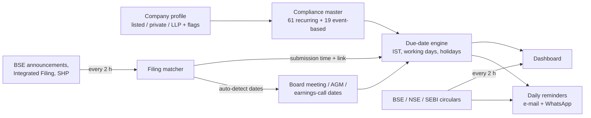

# Indian Compliance Calendar

**A free, open-source compliance calendar and reminder system for Company Secretaries, CFOs and compliance teams in India.**
It knows every recurring statutory deadline for listed companies (NSE / BSE — equity and debt), unlisted public companies,
private limited companies and LLPs; works out due dates from your real board-meeting, earnings-call and AGM dates; checks
BSE to confirm each filing was actually made (with the exact submission date and time); and keeps reminding your team by
e-mail and WhatsApp until every item is closed.

It ships in two forms from this one repository:

1. **A web app** you run on any office PC, laptop or server (Node.js, no database server needed).
2. **A Claude skill** — upload it to Claude and Claude can install, run, explain, troubleshoot and extend the app for you in plain English.

[](LICENSE)


> **Disclaimer:** due dates are an operational aid, not legal advice. Items marked ⚠ have recently-amended timelines —
> always confirm against the latest SEBI / MCA / exchange circular before relying on them.

---

## Contents

- [Who is this for?](#who-is-this-for)
- [What problem does it solve?](#what-problem-does-it-solve)
- [Features in detail](#features-in-detail)
- [What it covers](#what-it-covers)
- [Quick start (5 minutes)](#quick-start-5-minutes)
- [Always-on hosting (no office PC)](#always-on-hosting-no-office-pc)
- [Using it as a Claude skill](#using-it-as-a-claude-skill)
- [Configuration (`.env`)](#configuration-env)
- [How it works](#how-it-works)
- [Repository layout](#repository-layout)
- [Documentation](#documentation)
- [Security & data](#security--data)
- [Limitations](#limitations)
- [Contributing](#contributing)
- [Licence](#licence)

---

## Who is this for?

| You are… | You get… |
|---|---|
| **Company Secretary / Compliance Officer of a listed company** | One dashboard of every LODR, PIT, SAST, DP, ICDR and Companies Act deadline, auto-ticked when BSE shows the filing. |
| **CFO / Financial Controller** | Visibility of what is due, what is overdue and what was filed late — without chasing the secretarial team. |
| **Practising Company Secretary (PCS) firm** | Separate client workspaces, each with its own companies, recipients, mailbox and logins. |
| **Private company / LLP** | MCA / ROC and LLP Act deadlines (AOC-4, MGT-7, DPT-3, MSME-1, DIR-3 KYC, Form 8, Form 11 …) plus optional tax & labour dates. |
| **Debt-listed (NCD) issuer** | Reg 50 / 52 / 54 / 57 debt-segment items alongside equity items. |

## What problem does it solve?

Most compliance trackers are static Excel sheets: someone has to type every due date, remember that Reg 29 depends on
the board-meeting date, and manually check BSE to see whether the shareholding pattern really went up. Things get missed
when people are on leave or when a timeline changes through a new circular.

This app replaces that sheet with a system that:

- **knows the rules** — 61 recurring and 19 event-based compliances are pre-loaded with their regulation and timeline;
- **derives dates from events** — enter (or let it auto-detect) the board-meeting date and every results-cycle item moves with it;
- **verifies, not trusts** — it reads BSE and records *when* each filing was actually submitted;
- **nags until done** — reminders start N days before the due date and repeat daily until the item is filed;
- **keeps you current** — new BSE, NSE and SEBI circulars arrive in the dashboard with unread badges.

## Features in detail

### 📅 Compliance calendar
- Items grouped **Monthly / Quarterly / Half-yearly / Annual / Event-based**, each with its regulation, timeline, due date, status and BSE submission time.
- **Applicability by profile** — tick what applies to the entity (listed equity, listed debt, unlisted public, private, LLP, monitoring agency, earnings calls, BRSR, Large Corporate, cost audit, CSR, tax & labour) and only relevant items appear.
- **Statuses & summary cards:** Total Compliances, Pending Filings, Due Today, Overdue, Upcoming Deadlines and Completed, shown at the top of the calendar.
- **Mark past items done…** in one click when you first onboard a company, so historical items don't flood the first reminder.

### 🔗 Event-driven due dates
- **Results cycle:** Reg 29 prior intimation, outcome of board meeting, Reg 33 / Integrated Filing – Financials, Reg 47 newspaper publication, investor presentation, earnings-call intimation, audio recording and transcript all follow the **board-meeting / earnings-call date**.
- **AGM cycle:** AOC-4, MGT-7, ADT-1, MGT-15 and Reg 44(3) voting results follow the **AGM date**.
- **Working-day rules** skip weekends and the exchange holidays you enter.
- Until an event date is known, the **statutory latest date** is shown so nothing looks "not due".

### 🏛 Automatic BSE verification
- Every 2 hours (and just before the daily e-mail) the app reads BSE **Corporate Announcements**, **Integrated Filing – Governance**, **Integrated Filing – Finance** and **Shareholding Pattern** for each scrip.
- The exact **BSE submission date & time** and a **link to the filing** are written against the matching compliance and the item is ticked.
- Board-meeting and AGM dates are **auto-detected** from announcements, so the calendar fills itself.
- If BSE blocks ordinary requests, the app transparently falls back to a hidden Chrome / Edge window.

### ✉ Reminders
- **E-mail:** daily digest per company from N days before due (default 5) until filed; overdue items keep reminding; snooze per item; To + CC recipients per company; each workspace can use its own sender mailbox (Gmail, Outlook, Zoho or any SMTP).
- **WhatsApp — free:** one-tap "Forward on WhatsApp" buttons (official `wa.me` click-to-chat, no account, no cost).
- **WhatsApp — automatic (optional):** via Twilio with an approved utility template.

### 📢 Regulatory circulars
- **BSE** circulars to listed companies, **NSE** circulars to listed companies (equity & debt), **SEBI** circulars, master circulars and regulations.
- Refreshed every 2 hours, **per-user unread tracking**, Equity / Debt filter, and new circulars are added to the daily e-mail.

### 👥 Team & clients
- Owner account, team members (Admin / Member roles) and **separate client workspaces**.
- Invite links, workspace join links and optional public trial sign-up; plan, company limit and expiry date per client.
- **Activity log** of every change (who changed which date, when).

## What it covers

| Law / regulation | Examples of items tracked |
|---|---|
| **SEBI LODR (equity)** | Reg 7(3), 13(3), 23(9), 24A, 27(2), 29, 30, 31(1)(b), 32, 33, 34, 40(9), 44(3), 46, 47, BRSR, Integrated Filing (Governance & Financials), earnings calls |
| **SEBI LODR (debt)** | Reg 50(1), 52, 52(4), 52(7)/(7A), 52(8), 53, 54, 57(1), 57(4), 57(5), Large Corporate initial & annual disclosure |
| **SEBI PIT** | Trading-window closure, Reg 7(2)(b) continual disclosure |
| **SEBI SAST** | Reg 31(4) annual encumbrance declaration |
| **SEBI DP Regulations** | Reconciliation of Share Capital Audit, Reg 74(5) certificate |
| **SEBI ICDR** | Monitoring Agency report (Reg 32(6) / Reg 30) |
| **Companies Act 2013 / MCA** | Sec 173 board meetings, AGM, AOC-4, MGT-7/7A, MGT-15, ADT-1, DPT-3, MSME-1, PAS-6, MBP-1/DIR-8, DIR-3 KYC, CRA-2, CRA-4, CSR-2, MR-3, independent directors' meeting |
| **LLP Act** | Form 8, Form 11 |
| **Exchange / Depository** | Annual listing fee (BSE/NSE), NSDL/CDSL custody fee |
| **Tax & labour (optional)** | TDS/TCS deposit & returns, GSTR-1, GSTR-3B, GSTR-9/9C, PF & ESI, advance tax, tax audit, ITR |

The full list — every item with its frequency, timeline and BSE check — is in
[`references/compliance-master.md`](references/compliance-master.md).

## Quick start (5 minutes)

**You need:** [Node.js 18 or newer](https://nodejs.org), `curl` (built into Windows 10+, macOS and most Linux) and
Google Chrome or Microsoft Edge.

```bash
git clone https://github.com/parinshahAIbuilder/indian-compliance-calendar.git
cd indian-compliance-calendar
node scripts/deploy_app.mjs ./compliance-calendar --org "Your Firm"
cd compliance-calendar
node server.js
```

Then:

1. Open **http://localhost:4300** and create the **owner account** (first-time setup screen).
2. Go to **⚙ Companies & Settings → Add** and type the company name, BSE code, NSE symbol or ISIN; pick it from the lookup.
3. The app checks BSE immediately — the calendar arrives pre-filled with actual filing dates.
4. Click **Mark past items done…** once to clear historical items that have no BSE footprint.
5. Go to **✉ Email Updates → Sender account** and connect the mailbox that will send reminders (use an *app password*).
6. Add To / CC recipients per company. Done — reminders start automatically.

On Windows you can simply double-click **`start.bat`** inside the app folder (it installs dependencies, creates `.env`
and opens the browser).

👉 Step-by-step instructions with screenshots-in-words for each OS: **[docs/getting-started.md](docs/getting-started.md)**.

Check that BSE / NSE / SEBI are reachable at any time:

```bash
node scripts/check_sources.mjs
```

## Always-on hosting (no office PC)

Reminders only go out while the app is running. To stop depending on an office PC that may sleep or be switched off,
run it on a small cloud server — Oracle Cloud's *Always Free* tier in Mumbai works well (Indian IP for BSE/NSE).
On a fresh Ubuntu server, one command installs everything (Node.js, headless Chromium for the BSE fallback, HTTPS via
Caddy, a systemd service that starts on boot and restarts on failure):

```bash
curl -fsSL https://raw.githubusercontent.com/parinshahAIbuilder/indian-compliance-calendar/main/deploy/server-setup.sh | sudo bash
```

👉 Click-by-click guide: **[deploy/ORACLE-CLOUD.md](deploy/ORACLE-CLOUD.md)** · moving existing data: `deploy/migrate-to-server.sh`.

## Using it as a Claude skill

This repository is also a ready-made [Claude skill](https://docs.claude.com/en/docs/agents-and-tools/agent-skills/overview)
(`SKILL.md` + `references/` + `scripts/` + `assets/app/`). Once installed, you can ask Claude things like:

- *"Set up a compliance calendar for our listed company."*
- *"Has the shareholding pattern for September been filed on BSE for scrip 500209?"*
- *"Add a new LODR compliance to the calendar."*
- *"The BSE check stopped working — fix it."*
- *"Share the dashboard with my team on the office Wi-Fi."*

**Install:** download `indian-compliance-calendar.skill` from the [Releases](https://github.com/parinshahAIbuilder/indian-compliance-calendar/releases) page and upload it in
Claude (Settings → Capabilities → Skills), or copy this folder into your Claude Code skills directory
(`~/.claude/skills/indian-compliance-calendar`). Full guide: **[docs/claude-skill.md](docs/claude-skill.md)**.

## Configuration (`.env`)

Created automatically from `.env.example` on first run. Restart the app after editing.

| Variable | Required | Purpose |
|---|---|---|
| `GMAIL_USER` | Optional* | Gmail address that sends reminders for the default workspace |
| `GMAIL_APP_PASSWORD` | Optional* | 16-character Google App Password (needs 2-Step Verification) |
| `ORG_NAME` | Optional | Name of your own (default) workspace |
| `MAIL_FROM_NAME` | Optional | Display name on reminder e-mails (default `Compliance Desk`) |
| `PORT` | Optional | Web port (default `4300`) |
| `APP_URL` | Optional | Public / intranet address used in e-mails and invite links |
| `BROWSER_PATH` | Optional | Path to Chrome / Edge if it isn't found automatically |
| `APP_SECRET` | Auto | Generated on first run; encrypts stored mailbox & Twilio secrets — **back it up** |

\* Alternatively connect a sender mailbox inside the app (Email Updates → Sender account), which is the recommended way.

## How it works



- **Storage:** a single JSON file, `data/db.json` — no database server.
- **Server:** Node.js + Express; real-time refresh of all open dashboards when anything changes.
- **Fetching:** system `curl` with browser headers (BSE's bot protection rejects Node's HTTP client), NSE session cookies, and a headless-browser fallback.

More detail: **[docs/how-it-works.md](docs/how-it-works.md)** and [`references/data-sources.md`](references/data-sources.md).

## Repository layout

```
.
├── README.md                   ← you are here
├── LICENSE                     MIT licence
├── SKILL.md                    instructions Claude reads when the skill is used
├── CHANGELOG.md                version history
├── CONTRIBUTING.md             how to report issues / propose changes
├── SECURITY.md                 how to report a vulnerability, data-handling notes
├── docs/
│   ├── getting-started.md      step-by-step installation for non-developers
│   ├── user-guide.md           every tab of the dashboard explained
│   ├── how-it-works.md         due-date engine, BSE matching, reminders, architecture
│   ├── claude-skill.md         installing and using the Claude skill
│   └── faq.md                  FAQ & troubleshooting
├── references/
│   ├── compliance-master.md    every compliance, frequency, timeline, BSE source
│   ├── data-sources.md         BSE / NSE / SEBI endpoints, headers, quirks
│   └── operations.md           accounts, e-mail, WhatsApp, hosting, known pitfalls
├── deploy/
│   ├── ORACLE-CLOUD.md         always-on hosting guide (free Oracle Cloud server)
│   ├── server-setup.sh         one-command Ubuntu install with HTTPS + auto-start
│   └── migrate-to-server.sh    move an existing installation's data to the server
├── scripts/
│   ├── deploy_app.mjs          install / upgrade the app into any folder
│   └── check_sources.mjs       health check of all data sources
└── assets/app/                 the web app (Node.js + Express)
    ├── server.js               API, scheduler, auth
    ├── lib/                    master list, due-date engine, BSE, circulars, mailer, WhatsApp
    ├── public/                 dashboard UI (HTML / CSS / JS)
    ├── start.bat               one-click start on Windows
    ├── install-autostart.ps1   run at Windows start-up (optional)
    └── share-online.ps1        share via Cloudflare tunnel (optional)
```

## Documentation

| Guide | Read it when… |
|---|---|
| [Getting started](docs/getting-started.md) | installing for the first time |
| [User guide](docs/user-guide.md) | learning what each tab and button does |
| [How it works](docs/how-it-works.md) | you want to understand or audit the logic |
| [Claude skill](docs/claude-skill.md) | you want Claude to run / extend it for you |
| [FAQ & troubleshooting](docs/faq.md) | something isn't working |
| [Compliance master](references/compliance-master.md) | checking which items and timelines are covered |
| [Operations](references/operations.md) | e-mail, WhatsApp, team access, hosting |
| [Always-on hosting](deploy/ORACLE-CLOUD.md) | running it 24×7 on a free cloud server |

## Security & data

- Passwords are **scrypt-hashed**; sessions are HttpOnly cookies; login is throttled (10 failures / 15 min / IP).
- Mailbox and Twilio secrets are **AES-256-GCM encrypted** with `APP_SECRET`.
- **Never commit `.env` or `data/`** — they are already in `.gitignore`. Back them up together.
- **Create the owner account before exposing any public link**, otherwise someone else could claim the platform.

See [SECURITY.md](SECURITY.md).

## Limitations

- **BSE only** for filing verification today; NSE-only companies are tracked but ticked manually.
- MCA / ROC forms, listing fees, MBP-1, DPT-3 etc. have no public footprint and are **marked done manually**.
- Exchange data is read from public BSE / NSE pages. If you plan to offer this **commercially**, check whether the exchanges require permission or a data licence.
- Billing for client workspaces is not built in (plans and expiry are tracked manually).

## Contributing

Issues and pull requests are welcome — especially timeline updates when SEBI / MCA amend a regulation (please cite the
circular). See [CONTRIBUTING.md](CONTRIBUTING.md).

## Licence

Released under the **[MIT Licence](LICENSE)** — free to use, copy, modify, merge, publish, distribute, sublicense and sell,
provided the copyright and licence notice are kept. Compliance timelines are provided **as-is, without warranty**; they are
not legal advice.
